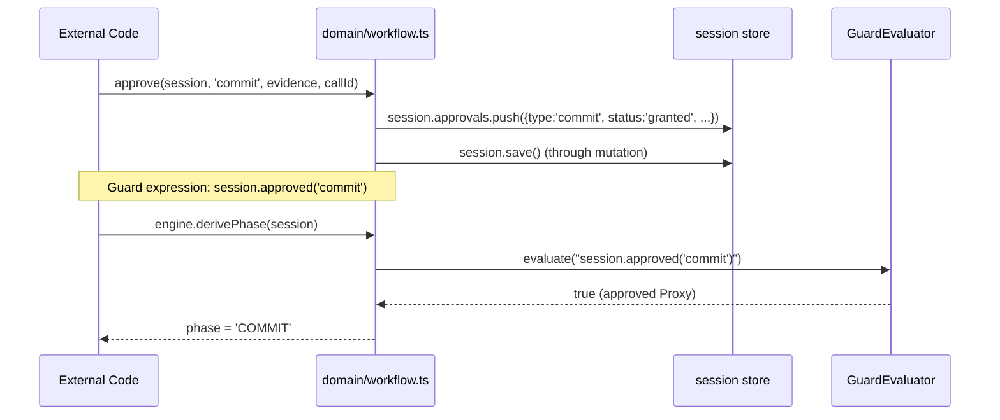
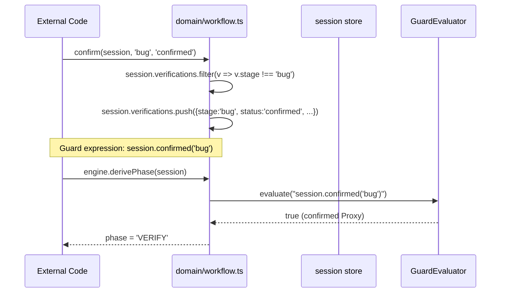

# Design: marker-refactoring

## AD1. Symmetric API Design

**Решение**: `approved()` / `approve()` и `confirmed()` / `confirm()` — симметричные пары глагол+причастие.

- **Чтение** — причастие прошедшего времени в Proxy GuardEvaluator:
  `session.approved(type)`, `session.confirmed(stage)`
- **Запись** — инфинитив в domain API:
  `approve(session, type, ...)`, `decline(session, type, ...)`
  `confirm(session, stage, ...)`, `reject(session, stage, ...)`

**Rationale**: Единый корень снижает когнитивную нагрузку — по первому слову понятно, о какой сущности речь.

## AD2. Verification[] вместо boolean

**Решение**: Массив `Verification[]` вместо булева `bugVerified`.

```typescript
interface Verification {
  stage: string;
  status: VerificationStatus;
  verifiedAt?: string;
  evidence?: string;
}

type VerificationStatus = 'pending' | 'confirmed' | 'failed';
```

**Rationale**:
- Одна сессия может иметь множество верификаций для разных стадий (bug, qa, review)
- `approved` для approvals и `confirmed` для verifications — симметричные проверки
- Статус `failed` позволяет явно отметить стадию как проваленную

## AD3. Approval[] покрывает commitPermit

**Решение**: `CommitPermit` удалён. Вместо него — `approve(session, 'commit', ...)` / `session.approved('commit')`.

**Rationale**: commit-permit — это то же решение человека, что и plan-approval, но другой тип.
Отдельный интерфейс и поле дублируют структуру Approval.

## AD4. Schema backward compatibility

**Решение**: `WorkflowSessionSchema` работает в `.strip()` mode. Старые JSON-файлы со старыми
именами полей отбрасываются, новые поля получают дефолты.

**Risk**: Потеря данных при загрузке старой сессии.

**Mitigation**: В spec S9 указан compatibility слой, который можно добавить при необходимости.

## AD5. Interface changes

### WorkflowSession (было → стало)

```typescript
// Было
interface WorkflowSession {
  commitPermit: CommitPermit;
  commitHash: string | null;
  bugVerified: boolean;
  baselineHashes: string[];
  changedFiles: string[];
  invariantViolations: InvariantViolationRecord[];
  retryBudgets: Record<string, RetryBudget>; // default: { cycles: { attempts: 0, max: 3 } }
  // ...
}

// Стало
interface WorkflowSession {
  deliveryReceipt: string | null;
  verifications: Verification[];
  scopeSnapshot: string[];
  modifiedArtifacts: string[];
  validationRecords: ValidationRecord[];
  retryBudgets: Record<string, RetryBudget>; // default: { mutation: { attempts: 0, max: 3 } }
  // ...
}
```

### SessionFacts (было → стало)

```typescript
// Было
interface SessionFacts {
  commitHash: string | null;
  commitPermit: { allowed: boolean } | null;
  bugVerified: boolean;
  // ...
}

// Стало
interface SessionFacts {
  deliveryReceipt: string | null;
  verifications: Verification[];
  // ...
}
```

## AD6. Data flow: approve



## AD7. Data flow: confirm



## AD8. GuardEvaluator Proxy

```typescript
private enhanceSession(session: Record<string, unknown>): Record<string, unknown> {
  return new Proxy(session, {
    get(target, prop, receiver) {
      if (prop === 'approved') {
        return (type: string): boolean => {
          const approvals = target['approvals'] as Array<{ type: string; status: string }> | undefined;
          if (!Array.isArray(approvals)) return false;
          return approvals.some(a => a.type === type && a.status === 'granted');
        };
      }
      if (prop === 'confirmed') {
        return (stage: string): boolean => {
          const verifications = target['verifications'] as Array<{ stage: string; status: string }> | undefined;
          if (!Array.isArray(verifications)) return false;
          return verifications.some(v => v.stage === stage && v.status === 'confirmed');
        };
      }
      return Reflect.get(target, prop, receiver);
    },
  });
}
```

## Test Strategy

### Unit tests: domain/workflow.ts

- `approve()` — новый тип (plan → commit)
- `approve()` — существующий approval обновляется
- `decline()` — новый decline с feedback
- `confirm()` — устанавливает verification
- `reject()` — устанавливает status = 'failed'
- `beginMutation()` — больше не сбрасывает bugVerified, сбрасывает verifications

### Unit tests: guard-evaluator.ts

- `session.approved('plan')` — работает на approvals
- `session.approved('commit')` — то же самое, другой type
- `session.approved('nonexistent')` — false
- `session.confirmed('bug')` — работает на verifications
- `session.confirmed('nonexistent')` — false
- `granted` больше не работает (Proxy удалил пропуск)

### Unit tests: session-facts.ts

- `SessionFacts.verifications` — проекция массива
- `SessionFacts.deliveryReceipt` — проекция строки

### Unit tests: session-schema.ts

- Zod rejects старые поля (strip)
- Zod парсит новые поля
- Defaults для новых полей

### Integration: YAML

- `profiles/state-machine.yaml` — все guard-выражения обновлены
